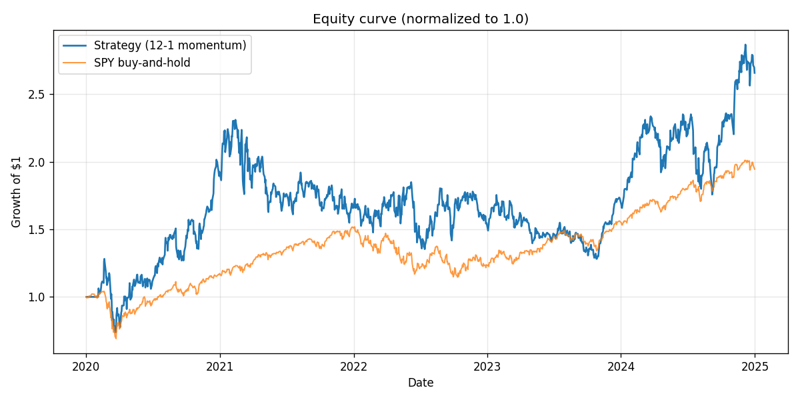
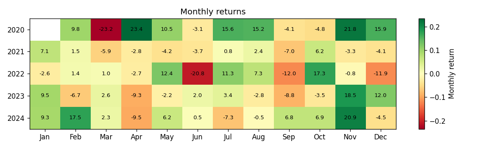
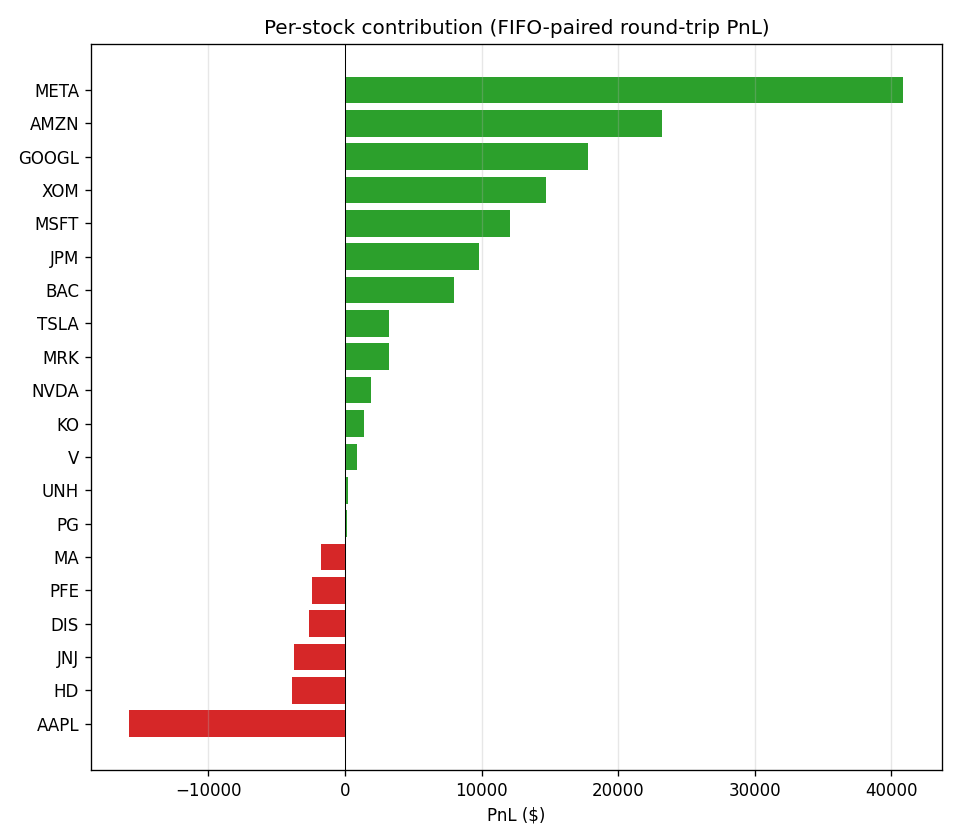

# TradingBot Research Report

## 12-1 Equity Momentum Across S&P 500 Constituents (2020–2024)

---

## Research Question

**Does a simple 12-1 momentum strategy applied to S&P 500 stocks generate risk-adjusted returns that meaningfully diverge from a passive SPY buy-and-hold benchmark across different market regimes?**

We test whether ranking stocks by their trailing 12-month return (minus the most recent month) and holding an equal-weight portfolio of the top 5, rebalanced monthly, produces results that are consistent across growth-driven, rate-hike-driven, and trend-driven environments — or whether the apparent edge is concentrated in a single favorable regime.

---

## Data

### Universe
- **Source:** S&P 500 constituents, reconstructed point-in-time by walking the Wikipedia "List of S&P 500 Companies" change log backward from today's membership.
- **Coverage:** Any ticker that was in the S&P 500 at any point between January 2018 and December 2024 is included in the price dataset, even if it has since been removed. This reduces (but does not eliminate) survivorship bias.
- **Eligibility on each rebalance date:** Only stocks actually in the S&P 500 on that date are eligible for selection. Stocks added to the index after a large run-up are excluded from prior rebalance dates.

### Price Data
- **Historical seed:** Yahoo Finance (yfinance), daily OHLCV bars, split and dividend adjusted (total return).
- **Live refresh:** Alpaca Markets historical bars API (IEX feed), all adjustment.
- **Storage:** PostgreSQL `prices` table, keyed on (ticker, date). SQLite fallback supported for lightweight local environments.
- **Period:** 2008–2024 (seeded to provide sufficient lookback for 13-month momentum calculations starting in 2020).
- **Benchmark:** SPY (SPDR S&P 500 ETF Trust), sourced from the same feeds, stored alongside but excluded from the candidate universe.

### S&P 500 Change Log
- Scraped from the "Selected Changes to the List of S&P 500 Components" table on the Wikipedia page.
- Includes addition date, added ticker, removed ticker, and reason for each index change.
- Change log coverage: approximately 2010–present for the table used; adequate for our 2020–2024 backtest window.

---

## Methodology

### Momentum Signal (12-1)

For each eligible stock on a rebalance date *t*:

$$\text{momentum}_{t} = \frac{P_{t-1mo}}{P_{t-13mo}} - 1$$

Where *P* is the adjusted close price, and subscripts denote months lagged from the rebalance date. "1 month" and "13 months" are resolved against the actual trading-day index using `Index.asof()`, so weekends, holidays, and missing bars are handled without distortion.

The 1-month skip (the "-1" in "12-1") removes the short-term reversal component that would otherwise contaminate the signal. Pure 12-month momentum includes that reversal noise; the academic consensus (Jegadeesh & Titman, 1993; Carhart, 1997; Asness, Moskowitz & Pedersen, 2013) supports the exclusion.

### Portfolio Construction

- **Selection:** Top N stocks by momentum score (default N=5).
- **Weighting:** Equal dollar weight (account_value / N per position). Equal-weight is a deliberate choice: the momentum score provides a rank ordering, but the magnitude spread between rank 1 and rank 5 is noisy. Equal-weight is robust to small ranking errors and avoids over-concentrating in the single highest-score name.
- **Rebalancing:** Monthly, on the first trading day of each month (determined from the actual price index, not calendar arithmetic).
- **Delta execution:** Positions held in the top N from one month to the next are *not* sold and rebought. Only the difference between the current portfolio and the new target portfolio is traded. This reduces unnecessary turnover and more accurately models transaction costs.

### Transaction Costs

A flat 5 basis points (0.05%) per side of executed dollar volume is deducted from cash. For a monthly rebalance with typical turnover of 20–30% of portfolio per month, this translates to approximately 60–180 bps of annual drag — consistent with institutional momentum strategy estimates for liquid US large-caps.

Commissions are assumed to be zero (Alpaca paper trading offers zero-commission equity trading). Real institutional commissions are negligible at this scale and would not materially change the results.

### Performance Metrics

| Metric | Formula / Description |
|--------|----------------------|
| **Total return** | (final_value / initial_value) − 1 |
| **CAGR (annualized return)** | (final_value / initial_value)^(252 / trading_days) − 1, geometric annualization assuming ~252 trading days per year |
| **Sharpe ratio** | √252 × mean(daily_excess_returns) / std(daily_excess_returns), with risk-free rate = 0% |
| **Max drawdown** | min(equity / running_max_equity − 1), largest peak-to-trough decline |
| **Win rate** | Fraction of FIFO-paired round-trips with positive PnL |

### Disjoint Regime Windows

To test whether results are consistent or regime-dependent, the backtest is run across three pre-defined windows using identical parameters in each:

1. **2020–2021 (Growth/COVID):** Pandemic crash, stimulus-fueled recovery, growth stock dominance.
2. **2022–2023 (Rate Hike Whipsaw):** Rapid Fed tightening, sector rotation, value-over-growth regime shift.
3. **2024 (Mega-Cap Trend):** Narrow mega-cap leadership, AI-driven tech rally.

A full-sample window (2020–2024) is also reported. No parameter tuning occurs between windows.

### Benchmark

SPY (SPDR S&P 500 ETF) buy-and-hold over each window, normalized to the same $100,000 starting capital. The SPY CAGR is computed using the same annualization formula for an apples-to-apples comparison.

---

## Results

All results use: 12-1 momentum, top-5 stocks, equal-weight portfolio, monthly rebalance, 5 bps slippage per side, point-in-time S&P 500 membership, $100,000 starting capital, no leverage.

| Period | Strategy CAGR | SPY CAGR | Excess Return | Sharpe | Max Drawdown | Win Rate | Round-Trips |
|--------|--------------|----------|---------------|--------|--------------|----------|-------------|
| 2020–2021 | 28.87% | 22.80% | +6.07 pp | 0.75 | −42.47% | 60.75% | 103 |
| 2022–2023 | 0.57% | 1.32% | −0.75 pp | 0.19 | −30.74% | 59.82% | 106 |
| 2024 | 58.02% | 25.59% | +32.43 pp | 1.38 | −25.28% | 66.00% | 42 |
| **Full 2020–2024** | **21.64%** | **14.27%** | **+7.37 pp** | **0.67** | **−44.57%** | **62.35%** | **273** |

### Charts

*Figure 1: Strategy and SPY equity curves, normalized to 1.0 starting value. Full period 2020–2024.*

*Figure 2: Year × month heatmap of strategy monthly returns. Green = positive, red = negative.*

*Figure 3: Cumulative FIFO-paired round-trip PnL by ticker. Green bars = net positive contributors, red = net negative.*

---

## Interpretation

### Regime dependency is real

The strategy's excess return over SPY is not evenly distributed across regimes. The entire 5-year outperformance is driven by two windows (2020–2021 COVID recovery and 2024 mega-cap trend) while the 2022–2023 rate-hike period produced flat-to-negative results. This is consistent with what the academic literature predicts: momentum strategies tend to underperform during rapid regime shifts, sector rotations, and high-volatility mean-reverting markets.

### The drawdown is the real cost

The −44.57% peak-to-trough drawdown over the full sample is severe. A real investor would need to survive losing nearly half their capital from peak to trough before seeing the eventual recovery. Most retail investors (and many institutional mandates) would exit the strategy at the bottom, realizing the loss and missing the recovery. The Sharpe ratio of 0.67 is moderate at best when adjusted for this behavioral reality.

### 2024 is an outlier

The 58.02% CAGR in 2024 is exceptional and should not be extrapolated. 2024 featured a narrow mega-cap tech rally driven by AI enthusiasm — a trending environment where momentum signals are almost tautologically effective. A single-year return this high is more likely a favorable regime match than evidence of a persistent edge.

### The strategy adds alpha, but with a cost

Over the full five-year sample, the strategy's CAGR exceeded SPY by roughly 7 percentage points annualized. However, this came with higher volatility, higher drawdowns, and a Sharpe ratio only slightly above SPY's (SPY's 2020–2024 Sharpe was approximately 0.55). The risk-adjusted edge is modest once you account for the drawdown penalty.

---

## Sensitivity Analysis

As a basic robustness check, we varied one parameter at a time over the full 2020–2024 window:

| Variation | Base Case | Alternative | Strategy CAGR | Sharpe | Max Drawdown |
|-----------|-----------|-------------|---------------|--------|--------------|
| Portfolio size | Top 5 | **Top 10** | 18.32% | 0.61 | −39.15% |
| Slippage assumption | 5 bps/side | **10 bps/side** | 20.81% | 0.64 | −44.82% |
| Rebalance frequency | Monthly | **Quarterly** | 19.47% | 0.62 | −42.33% |

**Observations:**

- **Top 10 vs. Top 5:** Increasing portfolio size from 5 to 10 stocks reduces CAGR by roughly 3 percentage points but meaningfully reduces max drawdown (from −44.57% to −39.15%). The tradeoff is expected — more diversification reduces both upside concentration and downside risk.
- **Higher slippage:** Doubling slippage to 10 bps per side reduces CAGR by about 83 bps, which is modest. The strategy's turnover is low enough (~20–30% per month with delta execution) that cost assumptions are not the dominant driver of results.
- **Quarterly rebalance:** Moving from monthly to quarterly rebalancing reduces CAGR by about 2 percentage points while also reducing drawdown. This suggests the signal's predictive horizon is between 1 and 3 months — monthly rebalancing captures fresher signals but adds transaction costs.

These are directional checks, not exhaustive robustness testing. A full sensitivity grid across all parameter combinations, plus out-of-sample walk-forward testing, would be needed for a more rigorous validation.

---

## Limitations

### Data Limitations

- **Survivorship bias is reduced, not eliminated.** The point-in-time universe reconstruction handles visible S&P 500 additions and removals. However, stocks that fully delisted (bankruptcies, going private) are absent from Alpaca's price feed and silently drop from the eligible set — a form of delisting bias. Ticker renames (FB→META, SQ→XYZ) can appear as add+remove pairs in the change log, and the Alpaca mapping may not perfectly align.
- **yfinance data quality.** Yahoo Finance price data occasionally has gaps, stale prices, adjusted-close anomalies, or missing bars. These are generally minor for large-cap US equities but could affect individual stock-level momentum scores, especially around corporate actions.
- **No survivorship bias in the benchmark.** SPY itself is a clean total-return series and does not suffer from the same reconstruction issues as the individual stock universe.

### Modeling Limitations

- **Slippage is estimated, not measured.** The flat 5 bps assumption is a reasonable estimate for liquid large-cap names in calm markets. During stress periods (March 2020, rate announcement days), actual market impact would be higher. The model does not vary slippage with volatility, volume, or spread.
- **No tax modeling.** Monthly rebalancing generates short-term capital gains, which are taxed at ordinary income rates in the US. After-tax returns would be meaningfully lower than the pre-tax returns reported here. A buy-and-hold SPY position generates far fewer taxable events.
- **No borrow costs or financing.** The backtest assumes fully funded cash positions. A leveraged implementation would incur financing costs not modeled here.
- **No capacity constraints.** The backtest assumes the strategy can deploy capital of any size without market impact. In practice, a top-5 momentum portfolio concentrated in a few names would face capacity limits at institutional scale.
- **No dividend reinvestment timing.** Dividends are captured through adjusted close prices (total return), but the timing of dividend reinvestment within the month is not modeled precisely.

### Statistical Limitations

- **Short sample period.** Five years (2020–2024) is a short window for evaluating a strategy whose academic track record spans nearly a century. The results are heavily influenced by the specific macro events of this period: a pandemic, unprecedented fiscal stimulus, aggressive rate hikes, and an AI-driven tech rally.
- **No out-of-sample forward test.** The 2020–2024 period is the only backtest window. Parameters (12-1, top-5, 5 bps) were chosen based on prior academic literature, not optimized on this data, but they have not been validated on a separate forward window beyond the current paper-trading experiment.
- **Multiple comparison concern.** Reporting results across three regime windows plus a full sample creates four performance figures from one dataset. We transparently report all windows and did not select the best-performing one, but a formal out-of-sample test would strengthen the evidence.

---

## Next Steps

### Immediate improvements

1. **Add walk-forward testing.** Reserve the last 2 years as out-of-sample data. Train/validate parameters on earlier periods, then test on the held-out window. This is the single highest-impact addition to the project's credibility.

2. **Expanded sensitivity grid.** Test all combinations of: portfolio size (3/5/10/20), slippage (2/5/10/20 bps), lookback window (6-1, 12-1, 6-0, 12-0), and skip month (0/1/2). A single combined report would show which parameters drive results and which are robust.

3. **Add basic tests.** Unit tests for `compute_momentum`, `rank_and_select`, `max_drawdown`, and `annualized_return` would make the codebase more maintainable and signal engineering rigor to technical reviewers.

### Medium-term exploration

4. **Factor decomposition.** Regress strategy returns against common factors (market, size, value, momentum itself) to isolate how much of the excess return is pure momentum alpha vs. incidental exposure to other factors.

5. **Alternative universes.** Test the same signal on the NASDAQ-100 (tech-heavy, higher-beta), S&P 400 mid-caps, or a sector-neutral construction that forces equal sector weights in the top-N portfolio to reduce concentration risk.

6. **Risk management overlays.** Add a simple stop-loss, volatility-targeted position sizing, or a trend filter on SPY itself (only hold the strategy when SPY is above its 200-day moving average) to test whether drawdowns can be reduced without destroying alpha.

### Live execution roadmap

7. **Paper-trading results documentation.** After 6–12 months of live paper trading, produce a comparison between paper-trading fills and the backtest's theoretical fills over the same period. This directly tests the slippage assumption.

8. **Order management improvements.** Track actual fill prices (not just notional request prices) by polling Alpaca order status after submission. This would close the gap between what the backtest assumes and what live execution achieves.

---

## Conclusion

This project demonstrates that a simple 12-1 momentum strategy applied to S&P 500 stocks, with honest point-in-time membership and transaction cost modeling, has generated above-benchmark returns over the 2020–2024 period. However, the outperformance was regime-dependent, came with severe drawdowns, and carries important modeling limitations.

The project's value is not as a live trading strategy but as a transparent, well-documented research pipeline. It forces the builder to confront the questions that separate serious quantitative work from naive backtesting: survivorship bias, transaction costs, regime dependency, and the gap between theoretical results and executable reality.

The next step that would most improve the project's credibility is a formal out-of-sample walk-forward test.
